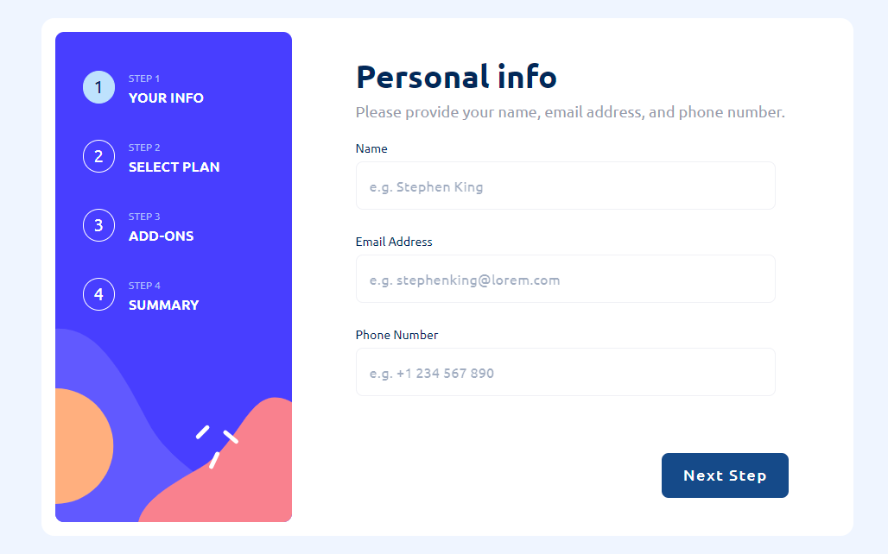

# Frontend Mentor - Multi-step form solution

This is a solution to the [Multi-step form challenge on Frontend Mentor](https://www.frontendmentor.io/challenges/multistep-form-YVAnSdqQBJ). realistic projects.

## Table of contents

- [Frontend Mentor - Multi-step form solution](#frontend-mentor---multi-step-form-solution)
  - [Table of contents](#table-of-contents)
  - [Overview](#overview)
    - [The challenge](#the-challenge)
    - [Screenshot](#screenshot)
    - [Links](#links)
  - [My process](#my-process)
    - [Built with](#built-with)
  - [Author](#author)
  - [essentials](#essentials)
    - [Project setup](#project-setup)
      - [Compiles and hot-reloads for development](#compiles-and-hot-reloads-for-development)
      - [Compiles and minifies for production](#compiles-and-minifies-for-production)
      - [Lints and fixes files](#lints-and-fixes-files)
      - [Customize configuration](#customize-configuration)

## Overview

### The challenge

Users should be able to:

- Complete each step of the sequence
- Go back to a previous step to update their selections
- See a summary of their selections on the final step and confirm their order
- View the optimal layout for the interface depending on their device's screen size
- See hover and focus states for all interactive elements on the page
- Receive form validation messages if:
  - A field has been missed
  - The email address is not formatted correctly

### Screenshot



### Links

- Solution URL: [vuetify-multi-step-form-code](https://github.com/Wong0790/vuetify-multi-step-form)
- Live Site URL: [vuetify-multi-step-form.netlify.app](https://wong0790-vuetify-multi-step-form.netlify.app/)

## My process

### Built with

- Semantic HTML5 markup
- Tailwind-CSS custom properties
- Flexbox
- CSS Grid
- Mobile-first workflow
- [Vuetify](https://vuetifyjs.com/) - Vue component framework
- [Vuelidate](https://vuelidate-next.netlify.app/) - For validations
- [Tailwindcss](https://tailwindcss.com/) - For styles
- [Pinia](https://pinia.vuejs.org/) - For state management

## Author

- Website - [Anneris Eloisa Wong Jorge](https://www.your-site.com)
- Frontend Mentor - [@Wong0790](https://www.frontendmentor.io/profile/Wong0790)
- Linkedin - [Anneris Wong Jorge](https://www.linkedin.com/in/anneris-wong-jorge-257948104)
- Github - [Anneris Wong Jorge](https://github.com/Wong0790)

## essentials

### Project setup

```
# yarn
yarn

# npm
npm install

# pnpm
pnpm install

# bun
bun install
```

#### Compiles and hot-reloads for development

```
# yarn
yarn dev

# npm
npm run dev

# pnpm
pnpm dev

# bun
bun run dev
```

#### Compiles and minifies for production

```
# yarn
yarn build

# npm
npm run build

# pnpm
pnpm build

# bun
bun run build
```

#### Lints and fixes files

```
# yarn
yarn lint

# npm
npm run lint

# pnpm
pnpm lint

# bun
bun run lint
```

#### Customize configuration

See [Configuration Reference](https://vitejs.dev/config/).
